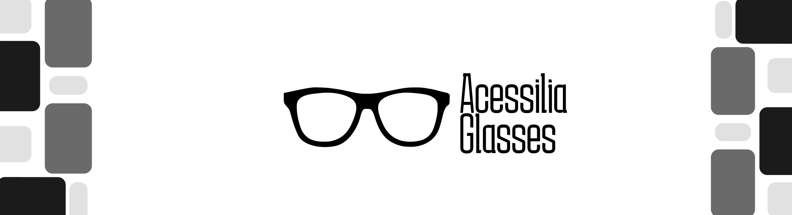
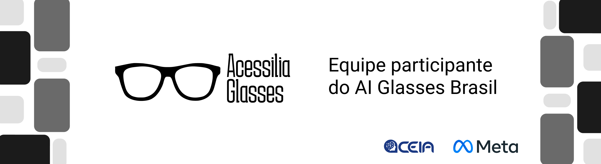

<link href="https://raw.githubusercontent.com/Acessilia-Glasses/.github/refs/heads/main/assets/style.css?token=GHSAT0AAAAAAD6NQQ2WUNXKR3ONBKMVC5ZW2T7Z2WA" rel="stylesheet">

# Acessilia Glasses 👓

O Acessília AI Glasses propõe o uso de óculos inteligentes equipados com câmera, microfone, saída de áudio, comandos de voz e recursos de inteligência artificial. Por meio dos óculos, o estudante poderá direcionar a câmera para um conteúdo educacional, solicitar sua interpretação por voz e receber uma descrição acessível, estruturada e contextualizada. A solução será integrada ao Acessília, um agente inteligente já existente, desenvolvido para transformar objetos educacionais complexos baseados em imagens em conteúdos acessíveis.

Diferentemente de descritores genéricos de imagens, o Acessília busca explicar informações relevantes para a aprendizagem, como:

* Títulos e organização do conteúdo;
* Eixos, legendas, unidades e escalas;
* Relações entre elementos;
* Tendências, comparações e variações;
* Etapas de processos;
* Estrutura de tabelas e diagramas;
* Significado de fórmulas e símbolos;
* Contexto educacional do objeto analisado.

## Integrantes 💻

<a href="https://github.com/mfelipesoares">

    <h2 class="nome-int">Marcos Felipe</h2>
    <h3 class="cargo-int">Coordenador/Desenvolvedor</h3>
    

</a>
<a href="https://github.com/jhonata192">

    <h2 class="nome-int">Jhonata Fernandes</h2>
    <h3 class="cargo-int">Pesquisador/Desenvolvedor</h3>
    

</a>
<a href="https://github.com/ingrydpassarin">

    <h2 class="nome-int">Ingryd Passarin</h2>
    <h3 class="cargo-int">Desenvolvedora</h3>
    

</a>

## Público Beneficiado

O público principal do projeto é formado por:

- Estudantes cegos;
- Estudantes com baixa visão;
- Professores;
- Profissionais de apoio educacional;
- Instituições de ensino;
- Equipes responsáveis pela produção de materiais acessíveis.

A solução poderá ser aplicada em escolas, universidades, cursos técnicos, ambientes de formação profissional e atividades educacionais presenciais ou remotas.

 

